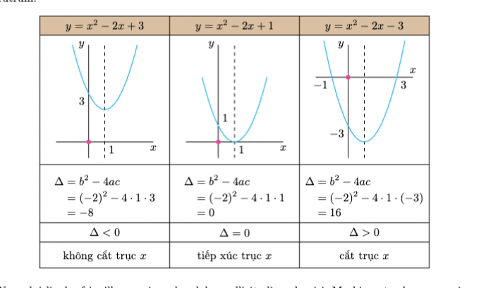
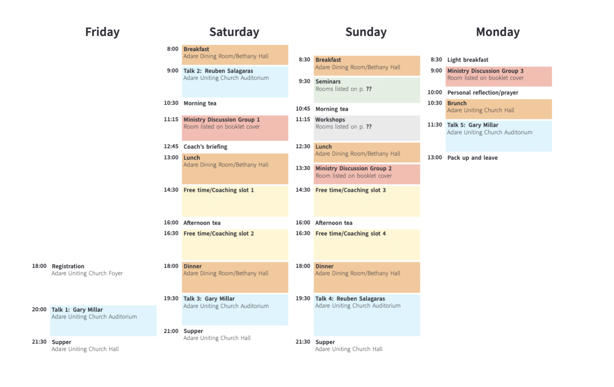
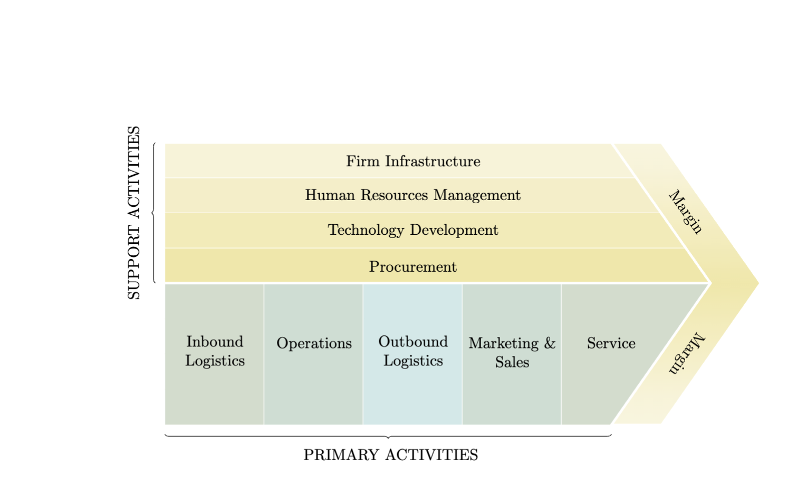
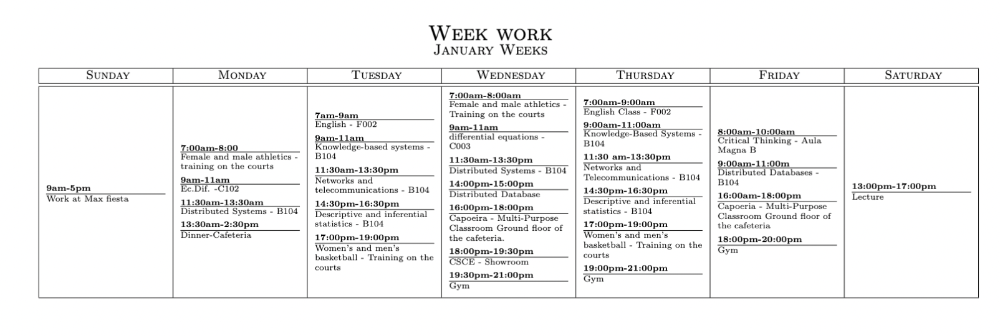
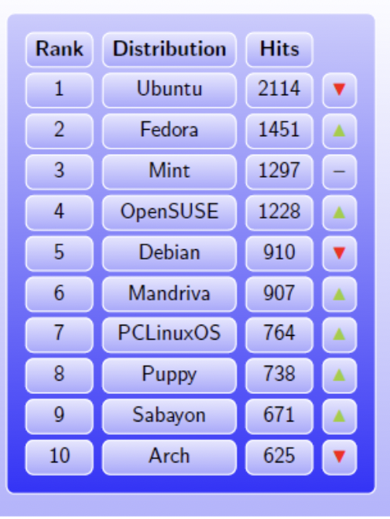

# latex-table-templates-
## table1

```latex
% tikz.vn 
% Le Huy Tien, HUS-VNU
%\documentclass[tikz,border=5mm]{standalone}
\documentclass{article}
\usepackage[margin=3.5cm]{geometry}
\usepackage[utf8]{vietnam}
\usepackage{tikz,amsmath,amssymb,amsthm,lipsum}
\usetikzlibrary{matrix}
\begin{document}
\centerline{\huge\bfseries\color{teal}HÌNH VẼ 100 DÒNG CODE}
\vspace{5mm}

\centerline{Lê Huy Tiễn, HUS-VNU}
\begin{center}
\begin{tikzpicture}
\fill[yellow] (20:1) arc(20:160:1)--cycle;
\fill[cyan!50] (20:1) arc(20:-200:1)--cycle;
\path[teal]
(0,.6) node[black]{tikZ.vn}	
(0,0) node{Elegant}
(0,-.4) node{Simplicity};
\end{tikzpicture}	
\end{center}

\lipsum[1]
\begin{center}
\tikzset{declare function={f(\x)=(\x)^2 -2*\x+3;},	
paranegative/.pic={
\draw 
(-2,0)--(4,0) node[below]{$x$}
(0,-1)--(0,6) node[left]{$y$}
(1,0) node[below right]{$1$}
(0,3) node[below left]{$3$};
\fill[magenta] (0,0) circle(4pt);
\draw[dashed] (1,-1)--(1,6);	
\draw[cyan,thick] plot[domain=-1:3] (\x,{f(\x)});
},% end of pic paranegative
parazero/.pic={
\draw 
(-2,0)--(4,0) node[below]{$x$}
(0,-1)--(0,6) node[left]{$y$}
(1,0) node[below right]{$1$}
(0,1) node[above right]{$1$};
\fill[magenta] (0,0) circle(4pt);
\draw[dashed] (1,-1)--(1,6);	
\draw[cyan,thick] plot[domain=-1:3] (\x,{f(\x)-2});
},% end of pic parazero
parapositive/.pic={
\draw 
(-2,0)--(4,0) node[above]{$x$}
(0,-5)--(0,2) node[left]{$y$}
(-1,0) node[below left]{$-1$}
(3,0) node[below right]{$3$}
(0,-3) node[below left]{$-3$};
\fill[magenta] (0,0) circle(4pt);
\draw[dashed] (1,-5)--(1,2);	
\draw[cyan,thick] plot[domain=-1.5:3.5] (\x,{f(\x)-6});
},% end of pic parapositive
}% end of tikzset

\begin{tikzpicture}
\matrix (m) [matrix of nodes,
nodes in empty cells,
ampersand replacement=\&,
row sep=-\pgflinewidth,
column sep=-\pgflinewidth,
nodes={minimum width=4cm,anchor=center,draw},
row 1/.style={nodes={fill=brown!50}},
row 2/.style={nodes={minimum height=4cm}},
row 3/.style={nodes={minimum height=1.8cm}},
row 4/.style={nodes={minimum height=6mm}},
row 5/.style={nodes={minimum height=8mm}},
]{
$y=x^2-2x+3$ \& $y=x^2-2x+1$ \& $y=x^2-2x-3$\\
\&\&\\
\&\&\\
$\Delta<0$\&$\Delta=0$\&$\Delta>0$\\
không cắt trục $x$\&tiếp xúc trục $x$\&cắt trục $x$\\
};
\path (m-3-1.center) node{
\begin{minipage}{3cm}
\noindent\begin{align*}
\Delta
&=b^2-4ac\\[-2pt]
&=(-2)^2-4\cdot 1 \cdot 3\\[-2pt] 
&=-8
\end{align*}
\end{minipage}
};
\path (m-3-2.center) node{
\begin{minipage}{3cm}
\noindent\begin{align*}
\Delta
&=b^2-4ac\\[-2pt]
&=(-2)^2-4\cdot 1 \cdot 1\\[-2pt] 
&=0
\end{align*}
\end{minipage}
};
\path (m-3-3.center) node{
\begin{minipage}{3cm}
\noindent\begin{align*}
\Delta
&=b^2-4ac\\[-2pt]
&=(-2)^2-4\cdot 1 \cdot (-3)\\[-2pt] 
&=16
\end{align*}
\end{minipage}
};
\path 
(m-2-1.center) pic[shift={(-.5,-1.3)},scale=.5]{paranegative}
(m-2-2.center) pic[shift={(-.5,-1.3)},scale=.5]{parazero}
(m-2-3.center) pic[shift={(-.5,.7)},scale=.5]{parapositive};
\end{tikzpicture}
\end{center}
\lipsum[2]
\end{document}	
```
## table2

```latex
\documentclass{article}

\usepackage[landscape,a4paper]{geometry}
\usepackage{microtype}
\usepackage[default,semibold,light]{sourcesanspro}
\usepackage{realscripts}
\usepackage{parskip}
\pagestyle{empty}

\newcommand*{\roomone}{Adare Uniting Church Auditorium}
\newcommand*{\roomtwo}{Adare Uniting Church Hall}
\newcommand*{\roomfour}{Adare Uniting Church Foyer}
\newcommand*{\roomsix}{Adare Dining Room}
\newcommand*{\roomtwelve}{Bethany Hall}
\newcommand*{\roomfood}{\roomsix\slash\roomtwelve}
\newcommand*{\roommdgs}{Room listed on booklet cover}
\newcommand*{\roomseminars}{Rooms listed on p.~\pageref{seminars}}
\newcommand*{\roomworkshops}{Rooms listed on p.~\pageref{workshops}}

\newcommand*{\firstspeaker}{Gary Millar}
\newcommand*{\secondspeaker}{Reuben Salagaras}

\newcommand*{\timetablefont}{\scriptsize}

\newcommand*{\yscale}{0.862}

\newlength{\timewidth}
\settowidth{\timewidth}{\timetablefont\bfseries
  \addfontfeature{RawFeature=-pnum}00:00}
\addtolength{\timewidth}{4pt}

\newlength{\activitywidth}
\setlength{\activitywidth}{\textwidth}
\addtolength{\activitywidth}{-4\timewidth}
\addtolength{\activitywidth}{-14pt}
\setlength{\activitywidth}{0.25\activitywidth}

\usepackage[cmyk]{xcolor}
\definecolor{mdg}{cmyk}{0,0.3,0.24,0.03}
\definecolor{talk}{cmyk}{0.13,0,0,0}
\definecolor{coach}{cmyk}{0,0.02,0.22,0}
\definecolor{food}{cmyk}{0,0.2,0.41,0.06}
\definecolor{seminar}{cmyk}{0.08,0,0.11,0.04}
\definecolor{workshop}{cmyk}{0,0,0,0.11}

\usepackage{tikz}
\usetikzlibrary{positioning,chains}

\begin{document}

\begin{tikzpicture}[
    remember picture,
    overlay,
    node distance=0 cm,
    chain default direction=going below,
    inner sep=0pt,
    outer sep=1pt,
    font=\timetablefont,
    time/.style args={#1,#2}{
      anchor=north west,
      minimum width=\timewidth,
      minimum height=\yscale*#1cm-2pt,
      node contents={},
      append after command={
        node[anchor=north east, inner sep=0pt, outer sep=3pt,
        font=\timetablefont\bfseries\addfontfeature{RawFeature=-pnum}]
        at (\tikzlastnode.north east) {#2}
      },
      on chain
    },
    activity/.style args={#1,#2,#3}{
      anchor=north west,
      minimum width=\activitywidth,
      minimum height=\yscale*#1cm-2pt,
      node contents={},
      append after command={
        node[anchor=north west, inner sep=0pt, outer sep=3pt,
        text width=\activitywidth-6pt]
        at (\tikzlastnode.north west) {\textbf{#2}\\#3}
      },
      on chain
    }
  ]
  \begin{scope}[start chain]
    \node (fri-time) [time={1,}];
    \node[time={10,}];
    \node[time={2,18:00}];
    \node[time={1.5,20:00}];
    \node[time={1,21:30}];
  \end{scope}
  \begin{scope}[start chain]
    \node (fri) [right=of fri-time.north east, activity={1,\Large\hfill
    Friday\hfill\strut,}];
    \node[activity={10,,}];
    \node[activity={2,Registration,\roomfour}];
    \node[activity={1.5,Talk 1: \firstspeaker,\roomone},fill=talk];
    \node[activity={1,Supper,\roomtwo}];
  \end{scope}
  \begin{scope}[start chain]
    \node (sat-time) [right=of fri.north east, time={1,}];
    \node[time={1,8:00}];
    \node[time={1.5,9:00}];
    \node[time={0.75,10:30}];
    \node[time={1.25,11:15}];
    \node[time={0.5,12:45}];
    \node[time={1.5,13:00}];
    \node[time={1.5,14:30}];
    \node[time={0.5,16:00}];
    \node[time={1.5,16:30}];
    \node[time={1.5,18:00}];
    \node[time={1.5,19:30}];
    \node[time={1.5,21:00}];
  \end{scope}
  \begin{scope}[start chain]
    \node (sat) [right=of sat-time.north east, activity={1,\Large\hfill
    Saturday\hfill\strut,}];
    \node[activity={1,Breakfast,\roomfood}, fill=food];
    \node[activity={1.5,Talk 2: \secondspeaker,\roomone}, fill=talk];
    \node[activity={0.75,Morning tea,}];
    \node[activity={1.25,Ministry Discussion Group 1,Room listed on booklet
    cover}, fill=mdg];
    \node[activity={0.5,Coach's briefing,}];
    \node[activity={1.5,Lunch,\roomfood}, fill=food];
    \node[activity={1.5,Free time\slash Coaching slot 1,}, fill=coach];
    \node[activity={0.5,Afternoon tea,}];
    \node[activity={1.5,Free time\slash Coaching slot 2,}, fill=coach];
    \node[activity={1.5,Dinner,\roomfood}, fill=food];
    \node[activity={1.5,Talk 3: \firstspeaker,\roomone}, fill=talk];
    \node[activity={1.5,Supper,\roomtwo}];
  \end{scope}
  \begin{scope}[start chain]
    \node (sun-time) [right=of sat.north east, time={1,}];
    \node[time={0.5,}];
    \node[time={1,8:30}];
    \node[time={1.25,9:30}];
    \node[time={0.5,10:45}];
    \node[time={1.25,11:15}];
    \node[time={1,12:30}];
    \node[time={1,13:30}];
    \node[time={1.5,14:30}];
    \node[time={0.5,16:00}];
    \node[time={1.5,16:30}];
    \node[time={1.5,18:00}];
    \node[time={2,19:30}];
    \node[time={1,21:30}];
  \end{scope}
  \begin{scope}[start chain]
    \node (sun) [right=of sun-time.north east, activity={1,\Large\hfill
    Sunday\hfill\strut,}];
    \node[activity={0.5,,}];
    \node[activity={1,Breakfast,\roomfood}, fill=food];
    \node[activity={1.25,Seminars,\roomseminars}, fill=seminar];
    \node[activity={0.5,Morning tea,}];
    \node[activity={1.25,Workshops,\roomworkshops}, fill=workshop];
    \node[activity={1,Lunch,\roomfood}, fill=food];
    \node[activity={1,Ministry Discussion Group 2,\roommdgs}, fill=mdg];
    \node[activity={1.5,Free time\slash Coaching slot 3,}, fill=coach];
    \node[activity={0.5,Afternoon tea,}];
    \node[activity={1.5,Free time\slash Coaching slot 4,}, fill=coach];
    \node[activity={1.5,Dinner,\roomfood}, fill=food];
    \node[activity={2,Talk 4: \secondspeaker,\roomone}, fill=talk];
    \node[activity={1,Supper,\roomtwo}];
  \end{scope}
  \begin{scope}[start chain]
    \node (mon-time) [right=of sun.north east, time={1,}];
    \node[time={0.5,}];
    \node[time={0.5,8:30}];
    \node[time={1,9:00}];
    \node[time={0.5,10:00}];
    \node[time={1,10:30}];
    \node[time={1.5,11:30}];
    \node[time={1,13:00}];
  \end{scope}
  \begin{scope}[start chain]
    \node[right=of mon-time.north east, activity={1,\Large\hfill
    Monday\hfill\strut,}];
    \node[activity={0.5,,}];
    \node[activity={0.5,Light breakfast,}];
    \node[activity={1,Ministry Discussion Group 3,\roommdgs}, fill=mdg];
    \node[activity={0.5,Personal reflection\slash prayer,}];
    \node[activity={1,Brunch,\roomtwo}, fill=food];
    \node[activity={1.5,Talk 5: \firstspeaker,\roomone}, fill=talk];
    \node[activity={1,Pack up and leave,}];
  \end{scope}
\end{tikzpicture}%

\end{document}
```
## table3

```latex
%\title{The Porter Value Chain} 
%
% Source: http://tex.stackexchange.com/questions/112579/table-in-the-shape-of-an-arrow/112681#112681
%
\documentclass{article}
\usepackage{tikz}
\usetikzlibrary{calc,matrix,decorations.markings,decorations.pathreplacing}

\definecolor{colone}{RGB}{209,220,204}
\definecolor{coltwo}{RGB}{204,222,210}
\definecolor{colthree}{RGB}{207,233,232}
\definecolor{colfour}{RGB}{248,243,214}
\definecolor{colfive}{RGB}{245,238,197}
\definecolor{colsix}{RGB}{243,235,179}
\definecolor{colseven}{RGB}{241,231,163}

\tikzset{ 
table/.style={
  matrix of nodes,
  row sep=-\pgflinewidth,
  column sep=-\pgflinewidth,
  nodes={rectangle,text width=2cm,align=center},
  text depth=1.25ex,
  text height=2.5ex,
  nodes in empty cells}
}

\begin{document}

\begin{tikzpicture}
\matrix (mat) [table]
{
|[fill=colfour]| & |[fill=colfour]| & |[fill=colfour]| & |[fill=colfour]| & |[fill=colfour]| &  \\
|[fill=colfive]| & |[fill=colfive]| & |[fill=colfive]| & |[fill=colfive]| & |[fill=colfive]| &  \\
|[fill=colsix]| & |[fill=colsix]| & |[fill=colsix]| & |[fill=colsix]| & |[fill=colsix]| & |[fill=colsix]| \\
|[fill=colseven]| & |[fill=colseven]| & |[fill=colseven]| & |[fill=colseven]| & |[fill=colseven]| & |[fill=colseven]| \\
|[fill=colone]| & |[fill=coltwo]| & |[fill=colthree]| & |[fill=coltwo]| & |[fill=colone]| & |[fill=colone]|  \\
|[fill=colone]| & |[fill=coltwo]| & |[fill=colthree]| & |[fill=coltwo]| & |[fill=colone]| & |[fill=colone]|  \\
|[fill=colone]| & |[fill=coltwo]| & |[fill=colthree]| & |[fill=coltwo]| & |[fill=colone]| & \\
|[fill=colone]| & |[fill=coltwo]| & |[fill=colthree]| & |[fill=coltwo]| & |[fill=colone]| &  \\
};

% horizontal rules
\foreach \row in {2,3,4}
  \draw[white] (mat-\row-1.north west) -- (mat-\row-6.north east);
\draw[white,ultra thick] (mat-1-1.north west) -- (mat-1-6.north east);
\draw[white,ultra thick] (mat-5-1.north west) -- (mat-5-6.north east);

% vertical rules
\foreach \col in {2,3,4,5}
  \draw[white] (mat-5-\col.north west) -- (mat-8-\col.south west);

% The labels
\node[fill=colfour] at (mat-1-3) {Firm Infrastructure};
\node[fill=colfive] at (mat-2-3) {Human Resources Management};
\node[fill=colsix] at (mat-3-3) {Technology Development};
\node[fill=colseven] at (mat-4-3) {Procurement};
\node at ([yshift=-10pt]mat-6-1) {\parbox[t]{2cm}{\centering Inbound Logistics}};
\node at ([yshift=-10pt]mat-6-2) {\parbox[t]{2cm}{\centering Operations \\\mbox{}}};
\node at ([yshift=-10pt]mat-6-3) {\parbox[t]{2cm}{\centering Outbound Logistics}};
\node at ([yshift=-10pt]mat-6-4) {\parbox[t]{2cm}{\centering Marketing \& Sales}};
\node at ([yshift=-10pt]mat-6-5) {\parbox[t]{2cm}{\centering Service \\\mbox{}}};
\node[rotate = 90] at ([xshift=-52pt]mat-3-1.north) {SUPPORT ACTIVITIES};
\node at ([yshift=-19pt,xshift=-0.5cm]mat-8-3.south) {PRIMARY ACTIVITIES};

% Erase some visible lines outside the arrow
\fill[white] (mat-1-5.north east) -- (mat-5-6.north east) -- (mat-1-6.north east) -- cycle;
\fill[white] (mat-8-5.north east) -- (mat-5-6.north east) -- (mat-8-6.north east) -- cycle;

% Draw the arrow tip
\shade[top color=colfour!70,bottom color=colfour!70,middle color=colseven,draw=white,ultra thick] 
  (mat-1-5.north) -- (mat-5-6.north) -- (mat-8-5.south) -- 
  (mat-8-5.south east) -- (mat-5-6.north east) -- (mat-8-5.south east) -- 
  (mat-5-6.north east) -- (mat-1-5.north east) -- cycle;

% The slanted "Margin" labels
\begin{scope}[decoration={markings,mark=at position .5 with \node[transform shape] {Margin};}]
\path[postaction={decorate}] 
  ( $ (mat-1-5.north)!0.5!(mat-1-5.north east) $ ) -- ( $ (mat-5-6.north)!0.5!(mat-5-6.north east) $ );
\path[postaction={decorate}] 
  ( $ (mat-5-6.north)!0.5!(mat-5-6.north east) $ ) -- ( $ (mat-8-5.south)!0.5!(mat-8-5.south east) $ );
\end{scope}

% The braces
\draw[decorate,decoration={brace,mirror,raise=6pt}]
  (mat-1-1.north west) -- (mat-5-1.north west);
\draw[decorate,decoration={brace,mirror,raise=6pt}]
  (mat-8-1.south west) -- (mat-8-5.south);
\end{tikzpicture}

\end{document}
```
## table4

```latex
%%%%%%%%%%%%%%%%%%%%%%%%%%%%%%%%%%%%%%%%%
% Weekly Timetable Calendar
% LaTeX Template
% Version 1.1 (4/6/13)
%
% This template has been downloaded from:
% http://www.LaTeXTemplates.com
%
% Original calendar style author:
% Evan Sultanik (http://www.sultanik.com/LaTeX_calendar_style)
%
% License:
% CC BY-NC-SA 3.0 (http://creativecommons.org/licenses/by-nc-sa/3.0/)
%
% Important note:
% This template requires the calendar.sty file to be in the same directory as the
% .tex file. The calendar.sty file provides the necessary structure to create the
% calendar.
%
%%%%%%%%%%%%%%%%%%%%%%%%%%%%%%%%%%%%%%%%%

%----------------------------------------------------------------------------------------
%	PACKAGES AND OTHER DOCUMENT CONFIGURATIONS
%----------------------------------------------------------------------------------------

\documentclass[landscape,a4paper]{article}

\usepackage{calendar} % Use the calendar.sty style

\usepackage[landscape,margin=0.5in]{geometry}

\begin{document}

\pagestyle{empty} % Removes the page number from the bottom of the page

\noindent

\StartingDayNumber=1 % Calendar starting day, default of 1 means Sunday, 2 for Monday, etc

%----------------------------------------------------------------------------------------
%	TITLE SECTION
%----------------------------------------------------------------------------------------

\begin{center}
\textsc{\LARGE Week work}\\ 
\textsc{\large January Weeks}
\end{center}

%----------------------------------------------------------------------------------------

\begin{calendar}{\hsize}

%----------------------------------------------------------------------------------------
%	FIRST DAY
%----------------------------------------------------------------------------------------

\day{}{\textbf{9am-5pm} \daysep Work at Max fiesta} % By default all daily events are centered in the box, in order to bring them up use \vspace{2cm} after the event text; you may need to change the 2cm

%----------------------------------------------------------------------------------------
%	SECOND DAY
%----------------------------------------------------------------------------------------

\day{}{
\textbf{7:00am-8:00} \daysep Female and male athletics - training on the courts  \\[3pt]
\textbf{9am-11am} \daysep Ec.Dif. -C102 \\[3pt]
\textbf{11:30am-13:30am} \daysep Distributed Systems - B104 \\[3pt]
\textbf{13:30am-2:30pm} \daysep Dinner-Cafeteria \\[3pt]
%\textbf{1pm-2pm} \daysep No Lecture \\[3pt]
%\textbf{3pm-4pm} \daysep BIOSCI101 Laboratory \\[3pt]
%\textbf{4pm-5pm} \daysep BIOSCI101 Laboratory
} 

%----------------------------------------------------------------------------------------
%	THIRD DAY
%----------------------------------------------------------------------------------------

\day{}{ % Tuesday
\textbf{7am-9am} \daysep English - F002 \\[3pt]
\textbf{9am-11am} \daysep Knowledge-based systems - B104 \\[3pt]
\textbf{11:30am-13:30pm} \daysep Networks and telecommunications - B104 \\[3pt]
%\textbf{12pm-1pm} \daysep No Lecture \\[3pt]
%\textbf{1pm-2pm} \daysep No Lecture \\[3pt]
\textbf{14:30pm-16:30pm} \daysep Descriptive and inferential statistics - B104 \\[3pt]
\textbf{17:00pm-19:00pm} \daysep Women's and men's basketball - Training on the courts \\[3pt]
%\textbf{4pm-5pm} \daysep No Lecture
} 

%----------------------------------------------------------------------------------------
%	FOURTH DAY
%----------------------------------------------------------------------------------------

\day{}{ % Wednesday
\textbf{7:00am-8:00am} \daysep Female and male athletics - Training on the courts \\[3pt]
\textbf{9am-11am} \daysep differential equations
 - C003 \\[3pt]
%\textbf{11am-12pm} \daysep No Lecture \\[3pt]
\textbf{11:30am-13:30pm} \daysep Distributed Systems - B104 \\[3pt]
\textbf{14:00pm-15:00pm} \daysep Distributed Database \\[3pt]
\textbf{16:00pm-18:00pm} \daysep Capoeira  - Multi-Purpose Classroom Ground floor of the cafeteria. \\[3pt]
\textbf{18:00pm-19:30pm} \daysep CSCE - Showroom \\[3pt]
\textbf{19:30pm-21:00pm} \daysep Gym \\[3pt]
} 

%----------------------------------------------------------------------------------------
%	FIFTH DAY
%----------------------------------------------------------------------------------------

\day{}{ % Thursday
\textbf{7:00am-9:00am} \daysep English Class - F002\\[3pt]
\textbf{9:00am-11:00am} \daysep Knowledge-Based Systems - B104 \\[3pt]
\textbf{11:30 am-13:30pm} \daysep Networks and Telecommunications - B104 \\[3pt]
\textbf{14:30pm-16:30pm} \daysep Descriptive and inferential statistics - B104\\[3pt]
\textbf{17:00pm-19:00pm} \daysep Women's and men's basketball - Training on the courts \\[3pt]
\textbf{19:00pm-21:00pm} \daysep Gym \\[3pt]
} 
%----------------------------------------------------------------------------------------
%	SIXTH DAY
%----------------------------------------------------------------------------------------

\day{}{ % Friday
\textbf{8:00am-10:00am} \daysep Critical Thinking - Aula Magna B \\[3pt]
\textbf{9:00am-11:00m} \daysep Distributed Databases  - B104 \\[3pt]
%\textbf{11am-12pm} \daysep No Lecture \\[3pt]
\textbf{16:00am-18:00pm} \daysep Capoeria -  Multi-Purpose Classroom Ground floor of the cafeteria\\[3pt]
\textbf{18:00pm-20:00pm} \daysep Gym \\[3pt]
%\textbf{2pm-3pm} \daysep No Lecture \\[3pt]
%\textbf{3pm-4pm} \daysep GEO101 Tutorial \\ Room A \\[3pt]
%\textbf{4pm-5pm} \daysep No Lecture
} 

%----------------------------------------------------------------------------------------
%	SEVENTH DAY
%----------------------------------------------------------------------------------------

\day{}{ % Saturday
\textbf{13:00pm-17:00pm} \daysep Lecture\\[3pt]
}
%----------------------------------------------------------------------------------------
 
\finishCalendar
\end{calendar}
\end{document}

```
## table5

```latex
\documentclass[svgnames]{beamer}
\setbeamertemplate{background canvas}[vertical shading]%
  [top=blue!1,bottom=blue!30]
\setbeamertemplate{navigation symbols}{}
\usepackage{tikz}
\usetikzlibrary{matrix}
\newcommand*\up{\textcolor{YellowGreen}{$\blacktriangle$}}
\newcommand*\down{\textcolor{Red}{$\blacktriangledown$}}
\newcommand*\const{\textcolor{darkgray}{\textbf{--}}}
\newcommand*\head[1]{\textbf{#1}}
\newenvironment{matrixtable}[4]{%
  \begin{tikzpicture}[matrix of nodes/.style={
    execute at begin cell=\node\bgroup\strut,
    execute at end cell=\egroup;}]
  \matrix (m) [matrix of nodes,top color=blue!20,
    bottom color=blue!80,draw=white,
    nodes={draw,top color=blue!10,bottom color=blue!35,
    draw,inner sep=2pt,minimum height=3.1ex},
    column sep=1ex,row sep=0.6ex,inner sep=2ex,
    rounded corners,column 1/.style={minimum width=#1},
    column 2/.style={minimum width=#2},
    column 3/.style={minimum width=#3},
    column 4/.style={minimum width=#4}]}%
{;\end{tikzpicture}}
\begin{document}
\begin{frame}[fragile,bg=lightgray]
\begin{center}
\begin{matrixtable}{1.2cm}{2.4cm}{1.2cm}{0.6cm}{
  \head{Rank}   & \head{Distribution} & \head{Hits} & \\
  1 & Ubuntu    & 2114 & \down  \\
  2 & Fedora    & 1451 & \up    \\
  3 & Mint      & 1297 & \const \\
  4 & OpenSUSE  & 1228 & \up    \\
  5 & Debian    & 910  & \down  \\
  6 & Mandriva  & 907  & \up    \\
  7 & PCLinuxOS & 764  & \up    \\
  8 & Puppy     & 738  & \up    \\
  9 & Sabayon   & 671  & \up    \\
 10 & Arch      & 625  & \down  \\
}
\end{matrixtable}
\end{center}
\end{frame}
\end{document}
```
